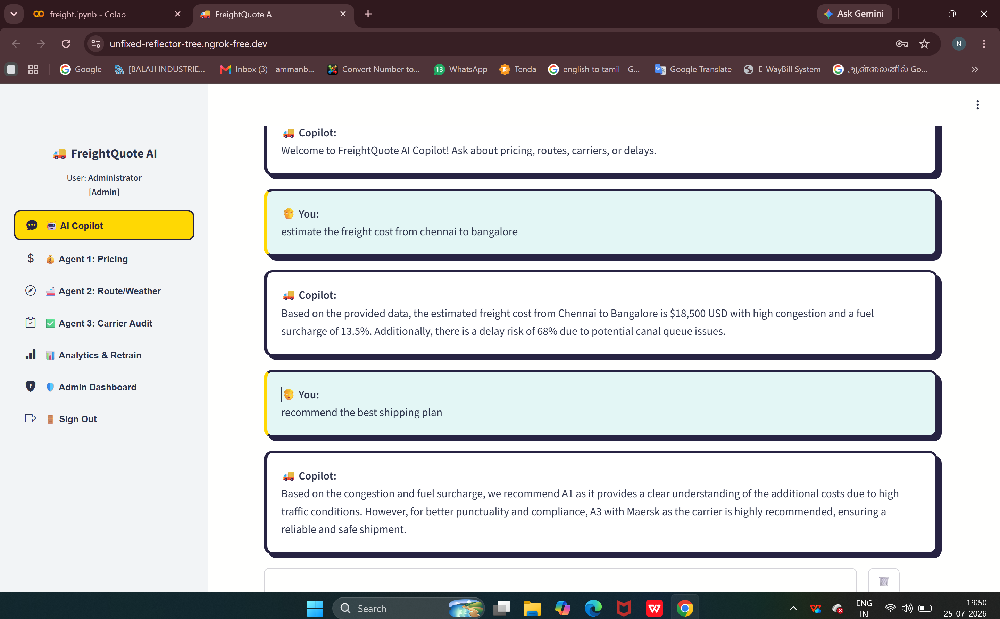

# Intelligent Freight Quote AI

## Milestone 2 - AI Agents, ML Pricing & Advanced Security

# Project Description

Intelligent Freight Quote AI is an AI-powered freight management system that generates intelligent freight quotes using Machine Learning, LLMs, and AI agents.
The system provides dynamic freight pricing, AI-based assistance, route optimization recommendations, and logistics insights. It also includes an Admin Panel for monitoring ML model performance, managing users, and maintaining application security.

# Features Implemented

## 1. AI Copilot
- Interactive AI assistant for freight and logistics queries.
- Accepts user prompts and generates intelligent responses.
- Provides freight-related recommendations.

## 2. ML Pricing Calculator
- Predicts freight cost using Machine Learning models.
- Accepts freight input details.
- Generates estimated pricing output.

## 3. AI Agent System

### Agent 1 – Dynamic Pricing Agent
- Predicts optimized freight cost.
- Uses ML model results for pricing decisions.

### Agent 2 – Route Optimization Agent
- Suggests efficient transportation routes.
- Helps reduce travel distance and cost.

### Agent 3 – Logistics Recommendation Agent
- Provides logistics suggestions and recommendations.

## 4. Admin Panel

### User Management
Admin can:
- Add users
- Delete users
- Unlock locked accounts

### ML Model Card
Displays:
- Model information
- R² Score
- RMSE
- Agent performance metrics

## 5. Security Enhancements
- Failed login attempt tracking.
- Account lockout after multiple failed attempts.
- 15-minute temporary account lock.
- OTP resend cooldown timer.


# Technologies Used

| Technology | Purpose |
|------------|---------|
| Python | Backend development |
| Streamlit | User interface |
| Machine Learning | Freight cost prediction |
| LLM | AI Copilot |
| Hugging Face Models | Natural Language Processing |
| Kaggle Dataset | ML training data |
| SQLite | Database management |
| JWT | Authentication security |
| Google Colab | Development environment |
| Ngrok | Public URL deployment |
| GitHub | Version control |


# Project Structure

```
Milestone2/
├── README.md
├── FreightQuote_AI_Milestone2.ipynb
└── screenshots/
    ├── home_page.png
    ├── ai_copilot.png
    ├── ml_pricing_calculator.png
    ├── admin_ml_model_card.png
    ├── admin_user_management.png
    ├── lockout_message.png
    └── otp_cooldown_message.png
```

# Google Colab Secrets Used

The following secrets are stored securely in Google Colab Secrets:

| Secret Name | Purpose |
|------------|---------|
| JWT_SECRET | Used for secure JWT token generation |
| NGROK_AUTHTOKEN | Used to create public Streamlit URL |
| EMAIL_ADDRESS | Used for sending OTP emails |
| EMAIL_PASSWORD | Gmail App Password for OTP authentication |
| ADMIN_EMAIL | Admin account email for dashboard access |
| ADMIN_PASSWORD | Admin account password (stored securely) |
| HUGGINGFACE_TOKEN | Access Hugging Face models |
| KAGGLE_USERNAME | Kaggle API username |
| KAGGLE_KEY | Kaggle API key |


# How to Run the Project

1. Open the `FreightQuote_AI_Milestone2.ipynb` notebook in Google Colab.

2. Install all required dependencies using the requirements file.

3. Configure the required secrets and API keys in Google Colab Secrets.

4. Upload the required dataset and project files.

5. Run all notebook cells sequentially.

6. Train and load the Machine Learning models.

7. Initialize the AI agents and LLM components.

8. Launch the Streamlit application.

9. Access the application using the generated Ngrok public URL.

10. Login with user or admin credentials to use the FreightQuote AI features.


# How to Create Ngrok Authentication Token

1. Go to the Ngrok website and create an account.

2. Login to your Ngrok account.

3. Open the Ngrok Dashboard.

4. Navigate to the **Your Authtoken** section.

5. Copy the generated authentication token.

6. Add the token to Google Colab Secrets:


NGROK_AUTHTOKEN = your_ngrok_token

# How to Create Hugging Face Token

1. Go to the Hugging Face website and create an account.

2. Login to your Hugging Face account.

3. Open:


Profile → Settings → Access Tokens


4. Click **Create New Token**.

5. Provide a token name and select required permissions.

6. Generate and copy the token.

7. Add the token to Google Colab Secrets:


HUGGINGFACE_TOKEN = your_token

# How to Create Kaggle Username and Kaggle Key

1. Go to the Kaggle website and create an account.

2. Login to your Kaggle account.

3. Open:


Profile → Settings


4. Navigate to the **API** section.

5. Click **Create New API Token**.

6. A `kaggle.json` file will be downloaded.

7. Open the file and copy:
   - Kaggle Username
   - Kaggle Key

8. Add them to Google Colab Secrets:


KAGGLE_USERNAME = your_username

KAGGLE_KEY = your_key


# Screenshots

### Home Page


The Home Page serves as the main dashboard after successful login. It provides secure access to all FreightQuote AI modules and system features.


## AI Copilot (Prompt + Response)



The AI Copilot answers freight and logistics-related queries using the Qwen2.5-3B language model. It provides intelligent suggestions to support shipping and logistics decisions.

## ML Pricing Calculator (Input + Predicted Cost)


The ML Pricing Calculator predicts the estimated freight cost based on user inputs such as distance, cargo details, and transportation information.


## Admin Panel – ML Model Card


The ML Model Card provides a summary of the trained machine learning models and their performance. It displays evaluation metrics such as R² Score, RMSE, and AI agent metrics, helping the administrator monitor the accuracy and effectiveness of the models.


## Admin Panel – User Management


The User Management module allows the administrator to add new users, delete existing users, and unlock locked accounts, ensuring secure and efficient management of application users.


## Account Lockout Message


The account lockout feature temporarily locks a user account after multiple failed login attempts, protecting the application from unauthorized access and brute-force attacks.


## OTP Cooldown Message


The OTP cooldown feature prevents users from requesting multiple OTPs within a short period. This improves security and helps prevent misuse of the OTP verification process.

